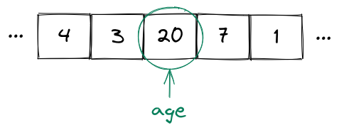

## Primitive Data Types

<div style="text-align: right"> <i> == is the equality operator <br> === is the one and true equality operator <br> ==== is the equality operator which transcends time and space <br> ===== is the equality operator which transcends all other equality operators <br> ====== is the equality operator which summons the UNSPEAKABLE DOOM (all is lost) <br> — from "The Book of the Equality Operators and their Virtue" by Laozi </i> </div>

### Variables

Whenever we write programs, we need to manipulate data.
This data needs to be stored in a location that we can access later.

We also need to deal with the fact that when we execute a program, the values we deal with are not predictable in advance.
For example, we don't know which tasks a user might create—allowing arbitrary tasks is, after all, the point of our application.
Nevertheless, we must be able to access created tasks through a predictable name like `tasks` or `createdTasks`.

Therefore, we need a way to put an unpredictable value somewhere and refer to it using a predictable name.
In programming, that "somewhere" is called storage and the predictable name is called a symbolic name.

A **variable** is simply a storage location that contains a value and is referred to by a symbolic name.
This sounds very fancy, but it just means that there is a value stored somewhere, and we can refer to it using a symbolic name that does not change—even when the value itself does.

For example, you could have a variable `age` which has the value `20`.
In this case, we say that `age` is equal to `20`:



Now, even if the value of `age` changes—for example, to `21` after a birthday—the variable name itself does not change, only the value does:


JavaScript lets you declare variables using the `let` keyword.
You can assign values to variables with the **assignment operator** (`=`):

```js
// Declare a variable
let x;

// Assign a value to a variable
x = 10;
```

You can print the value of the variable using the `console.log` method:

```js
console.log(x); // 10
```

> If we follow along in the Node.js or browser console, we don't actually need to use the `console.log` method to print the value of a variable.
> Instead, we can simply type the variable—or any other expression—and the console will display its value.
> For example, we can simply type `x` instead of `console.log(x)` and we will see the value of `x`.

You can also have a declaration and an assignment on a single line.
In fact, this is usually the way to go:

```js
let y = 10;
```

The value of a variable may change over the course of a program:

```js
let y = 10;
console.log(y); // 10

// Assign a new value to the variable
y = 20;
console.log(y); // 20
```

This code will first output `10` and then `20`.

> Remember that according to our book conventions, a comment after a `console.log` indicates the value that will be logged.

If you want to declare a predictable name for a value that never changes, you can declare a **constant**.
This is done using the `const` keyword:

```js
const ten = 10;
```

If you try to reassign a value to a constant, you will get an error.
For example, let's declare a constant and try to assign a new value to it:

```js
const ten = 10;
ten = 20;
```

This will result in the following error:

```
Uncaught TypeError: Assignment to constant variable.
```

You will almost exclusively see us using `const` instead of `let` from now on.
Reassignment is not nearly as necessary as you might expect at this stage.

> We can also declare variables using the `var` keyword.
> This will not be covered here and the only real thing you need to know about `var` is that you should basically never use it.
> That's because `var` has unusual behavior around scopes, a topic that we will cover later.
> For all practical purposes, you can treat `var` as a historical artifact of JavaScript.

Any variable has a **data type** which denotes the range of values it can take and which operations can be performed on the variable.
You can use the `typeof` operator to obtain the data type of a variable.

We begin with a few particularly important **primitive data types**.
These are numbers, booleans, strings and `undefined`.

### Numbers

We've already encountered the `number` data type:

```js
const age = 20;
console.log(typeof age); // number
```

Any integer or real number is a `number`:

```js
console.log(typeof 42); // number
console.log(typeof -20); // number
console.log(typeof 3.4); // number
console.log(typeof -1.7); // number
```

We can perform arithmetic on numbers using the usual arithmetic operators `+`, `-`, `*` and `/`.
There is also the `%` (modulo) operator which returns the remainder of a division.
Finally, there is the `**` operator which does exponentiation:

```js
const a = 3;
const b = 4;
console.log(a + b); // 7
console.log(a - b); // -1
console.log(a * b); // 12
console.log(a / b); // 0.75
console.log(a % b); // 3
console.log(a ** b); // 81
```

We can also use the **shorthand assignment operators** to combine assignment and arithmetic operators:

```js
let a = 3;
a += 4;
console.log(a); // 7
a -= 2;
console.log(a); // 5
a *= 3;
console.log(a); // 15
a /= 3;
console.log(a); // 5
a %= 3;
console.log(a); // 2
a **= 5;
console.log(a); // 32
```

We also use the **postfix increment** and the **postfix decrement** operators to increment or decrement a value by 1:

```js
let a = 4;
a++;
console.log(a); // 5
a--;
console.log(a); // 4
```

So far, everything is straightforward.
However, there are also some special values that belong to the `number` type.

One of these special values is `Infinity` which represents—well—mathematical infinity:

```js
console.log(Infinity); // Infinity
console.log(typeof Infinity); // number
```

One way to arrive at `Infinity` in JavaScript is to divide something positive by `0`:

```js
console.log(1 / 0); // Infinity
```

Another special value is `NaN` which stands for "not a number".
For example, the result of `0 / 0` is `NaN`:

```js
console.log(NaN); // NaN
console.log(0 / 0); // NaN
```

Even though its name explicitly suggests otherwise, `NaN` is indeed considered a number:

```js
console.log(typeof NaN); // number
```

Don't let that confuse you.

> We will not debate whether choices such as `1/0` being equal to `Infinity`, `0/0` being equal to `NaN` or `NaN` having type `number` are good decisions.
> For our purposes, it is enough to note that this is simply how JavaScript behaves.
> There has been plenty of discussion in the programming community around some of JavaScript's more—shall we say—controversial features.
> If you wish to do so, you can go on any programming forum of your choice and start a holy war by making fun of the way JavaScript's primitive data types work.
> Deciding whether that's a good use of time is up to you.

Another important thing about numbers is that you need to be careful when you are trying to perform operations with real numbers.
For example, if you add `0.1` and `0.2` you will get a weird result:

```js
console.log(0.1 + 0.2); // 0.30000000000000004
```

This is not a flaw specific to JavaScript.
It arises from the limitations of representing numbers with potentially infinite digits using finite computer hardware.

> We will not explore this problem in detail in this book.
> If you're interested in more details, we encourage you to have a look at the [IEEE754 standard](https://en.wikipedia.org/wiki/IEEE_754).
> Nevertheless, you should be aware of this behaviour and be careful when you are performing arithmetic operations with floating point numbers.

### Booleans

Another primitive data type is the `boolean`.
It allows us to represent values which are either `true` or `false`:

```js
const thisBookIsAwesome = true;
const thisBookSucks = false;
console.log(typeof thisBookIsAwesome); // boolean
console.log(typeof thisBookSucks); // boolean
```

We can perform simple logic using the logical operators:

- `&&` which denotes **and**,
- `||` which denotes **or**,
- `!` which denotes **not**.

The `&&` operator takes two values and evaluates to `true` only if both values are `true`.
Otherwise, it evaluates to `false`:

```js
console.log(true && true); // true
console.log(false && true); // false
console.log(true && false); // false
console.log(false && false); // false
```

The `||` operator takes two values and evaluates to `true` if _at least one_ of the values is `true`.
Otherwise, it evaluates to `false`:

```js
console.log(true || true); // true
console.log(false || true); // true
console.log(true || false); // true
console.log(false || false); // false
```

The `!` operator takes a single value and simply negates it, i.e. "switches" a value to its opposite:

```js
console.log(!true); // false
console.log(!false); // true
```

Here is an example with all the operators together:

```js
const b1 = true;
const b2 = false;
console.log(b1 && b2); // false
console.log(b1 || b2); // true
console.log(!b1); // false
```

> Note that, technically, the logical operators can work with any values, not only boolean values.
> The result of the logical operator application is then dependent on whether the values are truthy or falsy.
> We will discuss this later.

A boolean value often results from an expression, most commonly one that uses the **strict equality operator** (`===`) to compare variable values:

```js
const x1 = 5;
const x2 = 10;
const x3 = 5;
console.log(x1 === x1); // true
console.log(x1 === x2); // false
console.log(x1 === x3); // true
```

> There is also another equality operator (`==`) which performs various type coercions before doing the equality comparison (for example, `0 == "0"` will be `true`).
> This operator can be best described as an April Fools' joke that accidentally made it into the language.
> We strongly recommend that you never use it.

If you want to write _not equals_, you can use `!==`:

```js
console.log(5 !== 10); // true
console.log(5 !== 5); // false
```

Additionally, we can check if one value is less than or greater than another value using the `<`, `<=`, `>` and `>=` operators.
These are most commonly applied to numbers:

```js
console.log(2 < 3); // true
console.log(2 <= 3); // true
console.log(2 > 3); // false
console.log(2 >= 3); // false
```

### Strings

Another primitive data type is the `string`.
A string is simply a sequence of characters and is used to represent text.
Strings are usually written using single quotes in JavaScript:

```js
const s = 'Some text';
console.log(typeof s); // string
```

> Note that it's also possible to write strings using double quotes, i.e. `"Some text"`.
> However, in most projects, strings are written using single quotes, and we will follow this convention.
> Nevertheless, we want to stress that there is absolutely nothing wrong with using double quotes.
> The important thing is to remain consistent throughout a project—choose one style and stick with it.

The `+` operator works on strings and does concatenation:

```js
const s1 = 'Next.js ';
const s2 = 'book';
console.log(s1 + s2); // Next.js book
```

Instead of concatenating strings repeatedly, we can use **template strings**, also called **template literals**.
These allow us to embed JavaScript expressions directly inside strings.
Consider the following example:

```js
const s = 'World';
const greeting = `Hello, ${s}!`;
console.log(greeting); // Hello, World!
```

Template strings are written using backticks rather than single quotes.
They may contain **placeholders** which are expressions embedded inside `${...}`:

```js
console.log(`2 + 2 = ${2 + 2}`); // 2 + 2 = 4
```

> Technically, expressions inside template literals have to be "implicitly convertible to a string" because JavaScript has to convert any placeholder value to a string first.
> However, you will find that expressions not "implicitly convertible to a string" are pretty rare.

We can obtain the length of a string—that is, the number of characters it contains—like this:

```js
const s = 'Next.js book';
console.log(s.length); // 12
```

JavaScript does not have a special 'character' data type, unlike other languages like Java.
Instead, individual characters are simply strings of length one:

```js
const c = 'm';
console.log(typeof c); // string
```

There is much more to strings and we will return to them later.

> Strings are a complex data type, but we will omit many of the details since they are not relevant to simple web applications.
> Nevertheless, we should keep in mind that by the end of this book our understanding of strings will not be perfectly complete.

### Undefined

Finally, there is one more primitive type of interest to us: `undefined`.
This type has only a single value, also called `undefined`.

If a variable has the value `undefined`, this simply means that it hasn't been defined.
For example, a variable that has been declared but not assigned will automatically have the value, and therefore the type, `undefined`.

```js
let someVariable;
console.log(someVariable); // undefined
console.log(typeof someVariable); // undefined
```

We can also manually assign the `undefined` value to a variable:

```js
let someVariable = undefined;
console.log(someVariable); // undefined
console.log(typeof someVariable); // undefined
```

An important operator to know if you plan to work with `undefined` is the nullish coalescing operator `??`.
This operator takes two values and checks whether the left-hand side is `undefined` or `null`.
We will not focus much on `null` in this book.
If the left-hand side is `undefined` or `null`, the operator evaluates to the right-hand side.
Otherwise, it returns the left-hand side:

```js
console.log(undefined ?? 1); // 1
console.log(0 ?? 1); // 0
```

The `??` operator is commonly used to provide useful default values.

> Note that `string`, `number`, `boolean`, and `undefined` are not the only primitive data types.
> However, the others are beyond the scope of this book and will not be covered here.
