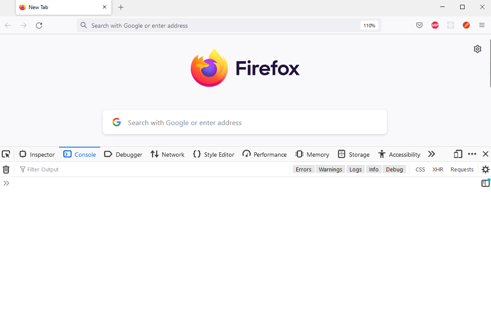
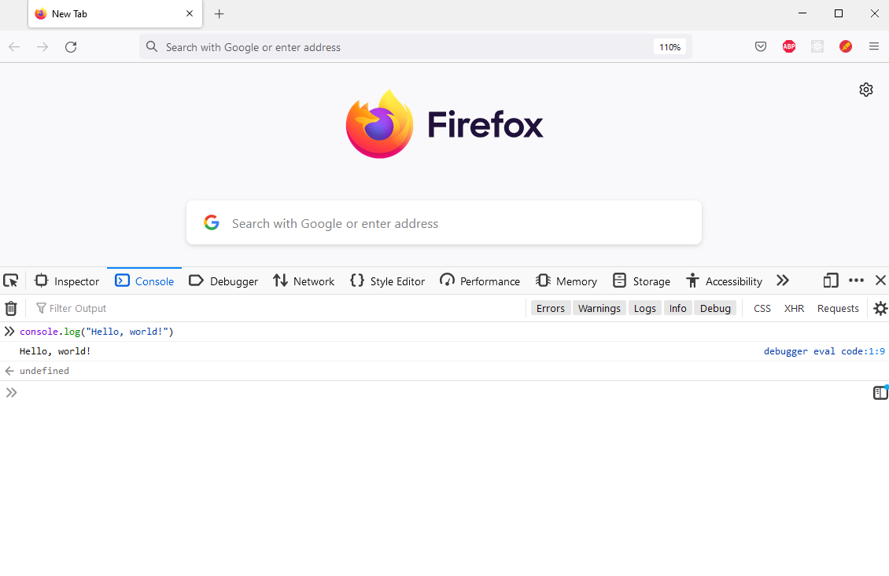

## Hello world

<div style="text-align: right"> <i> A journey of a thousand miles begins with a single "Hello, world!" program. <br> — Ancient Chinese proverb </i> </div>

### Runtime Environments

Contrary to popular belief, code sadly doesn't run on pixie dust, magic spells, and unicorn tears.
Instead, it runs on something called a **runtime environment** (also referred to as _runtime system_ or just _runtime_).
Put simply, a runtime is a program capable of executing code written in some programming language.
It _provides the environment in which programs can run_.
In order to execute all the _awesome_ JavaScript code we are about to write, we therefore need a runtime first.

There are two runtimes capable of executing JavaScript code, which are relevant to this book - the browser and Node.js.
The browser as well as the Node.js console have **REPL** (read-eval-print-loop) capabilities.
This means you can directly type some code into the console and execute it.
REPLs are very nice, because they allow you to quickly test what you just learned.
Additionally, both runtimes can execute a file containing JavaScript code.
This is how we will usually utilize the runtimes - we write a **script** (a file containing JavaScript code) and tell our runtime to execute it.

> As projects grow larger, we will usually be dealing with multiple files at the same time.
> We will talk about this in the "Modules" section of this chapter.

Every runtime environment comes with a **console**.
This isn't a retro gaming console; rather, it's a special part of the runtime where you can input commands and see the results of your code in real-time.
Think of it as a conversation between you and the program - you tell it what to do (input commands) and it responds by executing those commands and showing you what happened (output).

In this section we will set up the browser and Node.js runtimes.
Then we will print "Hello, world!" to both the browser console and the Node.js console to test that our setup functions as anticipated.

### The browser environment

Open a browser, and open its console.
How you do this will depend on the browser.

If you are using _Firefox_ the shortcut for opening the console is <kbd>Ctrl</kbd> + <kbd>Shift</kbd> + <kbd>K</kbd> on Windows or Linux and <kbd>Cmd</kbd> + <kbd>Option</kbd> + <kbd>K</kbd> on a Mac.
If you are using _Chrome_ or _Microsoft Edge_ the shortcut is <kbd>Ctrl</kbd> + <kbd>Shift</kbd> + <kbd>J</kbd> on Windows or Linux and <kbd>Cmd</kbd> + <kbd>Option</kbd> + <kbd>J</kbd> on a Mac.
If you are using _Safari_ on a Mac, you will need to enable the develop menu first by going to `Settings > Advanced` and ticking the box `Show Develop menu in menu bar`. Then you can open the console using <kbd>Cmd</kbd> + <kbd>Option</kbd> + <kbd>K</kbd>.

> If you are using Internet Explorer, please navigate to `google.com` and search for "Firefox" to install a _real_ browser.
> This line was originally intended to be a funny joke, but on June 15, 2022 Microsoft ended support for Internet Explorer, so it's not even a joke anymore.
> We personally recommend Firefox, but Chrome, Microsoft Edge or Safari are also fine choices.

This is approximately how the browser console will look on Firefox:



> Note that if you see a bunch of scary error or warning messages upon opening the console, _don't panic_ (this is also good life advice in general).
> Most of these will probably come from various extensions you might have installed or the web page you are currently viewing.
> You can simply delete these messages, as we don't care about them.

Let us print something using the `console.log` method. Type the following into the browser console:

```js
console.log('Hello, world!');
```

Now hit <kbd>Return</kbd> (you may also know this as <kbd>Enter</kbd> or simply <kbd>⏎</kbd>).
You will see the output "Hello, world!" in the console:



> Ignore the "undefined" for now.

Hooray, we printed something to the browser console!
This is the point at which you go tell everyone that you are now a *programmer*™.

### Executing JavaScript from an HTML file

As we already mentioned, instead of executing JavaScript in the browser console directly, we can (and often will) execute it from a JavaScript file.
Since we're on the browser, we will need to create two files - an HTML file and a JavaScript file.

HTML is short for _HyperText Markup Language_ and is the standard markup language for documents that should be displayed in a browser.
We will cover HTML in chapter 2, for now we just want to get a quick glimpse at it.

Create a new HTML file.
We will call it _hello.html_; however you can name it whatever you want.
The filename should have an _html_ extension though.

Open the HTML file in any text editor (we recommend you use [Visual Studio Code](https://code.visualstudio.com)) and add the following text to the file:

```html
<!DOCTYPE html>
<html>
  <head></head>
  <body>
    <script src="hello.js"></script>
  </body>
</html>
```

Don't forget to save the file!

Now create another file called _hello.js_ in the same directory as _hello.html_ with the following content:

```js
console.log('Hello, world');
```

> Note the semicolon after the `console.log`.
> It terminates the `console.log` statement.
> The semicolon is not technically required here.
> Indeed there are many JavaScript programmers who don't write semicolons.
> However, to avoid a bunch of pitfalls, we will use semicolons throughout this book and therefore we want you to get used to them as soon as possible.

Now open this file in your browser by simply double-clicking the file.
After opening this file in your browser, open the console again. You should see `Hello, world!` printed there.

Congratulations, you wrote your first script!

### Working with a Command Line

Now that we know how to use the browser runtime, we will move on to Node.js.
However, before we can do that, we will need to learn how to interact with the **command-line interface** (also called command line, command prompt or CLI).
A command line allows you to execute various tasks called commands.

If you're on Ubuntu, you can open the command line by pressing <kbd>Ctrl</kbd> + <kbd>Alt</kbd> + <kbd>T</kbd>.

On a Mac, you can open the command line by pressing <kbd>Cmd</kbd> + <kbd>Space</kbd> to open _search_, typing _terminal_ and then hitting <kbd>Return</kbd>.

Now that you've opened a CLI, you can type a command and hit <kbd>Return</kbd> to execute it.
Try executing this command for starters:

```sh
echo 'Hello, world!'
```

> Generally whenever we tell you to execute a command you need to type it in the CLI and hit <kbd>Return</kbd>.

### Node.js

For a long time, JavaScript was mostly used inside the browser runtime environment by programmers.
However in 2009 Node.js came along and changed that by allowing programmers to easily run JavaScript outside the browser.

Node.js will probably not be installed on your machine, so let's fix that.
First, we will install the **Fast Node Manager** (**fnm** for short) which will allow us to manage Node.js versions in a simple and straightforward manner.

On Linux you will need to run the following:

```sh
curl -fsSL https://fnm.vercel.app/install | bash
source ~/.bashrc
```

On Mac you will need to run the following:

```sh
curl -fsSL https://fnm.vercel.app/install | zsh
source ~/.zshrc
```

Check that `fnm` was successfully installed:

```sh
fnm --version
```

Finally we will install Node.js (version 18):

```sh
fnm install 18
```

And again verify that Node.js was successfully installed:

```sh
node --version
```

Now that Node.js is installed, you can open a Node.js console by typing node in the command line.
Now let's again print "Hello, world!" using the `console.log` method.
Type the following into the Node.js console and hit <kbd>Return</kbd>:

```js
console.log('Hello, world!');
```

You should see `"Hello, world!"` printed to the console.

### Executing a file

Before moving on, let's execute a JavaScript file in Node.js as well.
Create a file named `hello.js`.
Open the file in any text editor and add the following content to the file:

```js
console.log('Hello, world!');
```

Again open a command line and _change the current directory location to the directory containing the JavaScript file_.
You can do so using the _cd_ command. For example if `hello.js` is located at `/home/users/user` you would execute the following:

```sh
cd /home/users/user
```

Now execute the JavaScript file by running:

```sh
node hello.js
```

This should again print `"Hello, world!"`.

Note that for the remainder of chapter 1 you should follow along using the Node.js console as we will be discussing the language itself.
Nevertheless, as we begin writing the project in chapter 2, we will have to write JavaScript for the browser runtime environment on a regular basis.

### Statements and expressions

Before we dive into JavaScript, you should know that programs are made of statements and expressions.

A **statement** is a syntactic unit responsible for executing some action.
A **program** is then essentially a sequence of statements which should be executed when running the program.
For example `console.log('Hello, world!')` is a statement which executes the action of printing "Hello, world!" to the console.

An **expression** is a syntactic unit that may be evaluated to get its value.
For example `2 + 2` would be an expression which would evaluate to `4`.
Note that since any expression also executes some action, any expression is therefore a statement.

You could put it this way: Statements in general are executed to make something happen, while expressions in specific are evaluated to produce a value.

### Comments

Everything that is after a double slash on a line in JavaScript is a **comment**.
Comments are ignored by the runtime and therefore have no effect for the execution of your program:

```js
// This is just a comment
// Comments have no effect
console.log('Hello, world!');
// Therefore this program is equivalent to the
// program from the previous chapter
```

We will heavily utilize comments throughout this book inside the code blocks to highlight important ideas.

> There is a lot of discussion on how much you should comment your programs.
> We will return to this when discussing functions.
> However one rule is that if your code is so terrible that it requires _extensive commentary_ to explain its behavior or purpose, you should fix the code.
> Just like a work of art, your code should stand on it's own merits.
> Imagine _commenting_ a work of art (oh, wait)...
> However it is better to have terrible code and comments than have terrible code and no comments.

We will also adopt the convention that if a comment is next to a line with a `console.log` statement, that comment shows the output that would be logged to the console if the code was run. For example:

```js
console.log('Hello, world!'); // Hello, world!
```

This is the point where we tell you that while you are reading this book you should _absolutely follow along in some runtime_ (probably Node.js, but a browser is fine too).
This is _very important_.
Go ahead and open a Node.js console _now_.

Come on, we'll wait...

...

...

...

_Finally_.
Let's move on.

### Summary

You learned about the JavaScript browser runtime, Node.js and how to use the console of the various runtimes.
You learned how to execute code in a REPL as well as how to execute scripts.

### Further reading

There is no further reading for this section.
