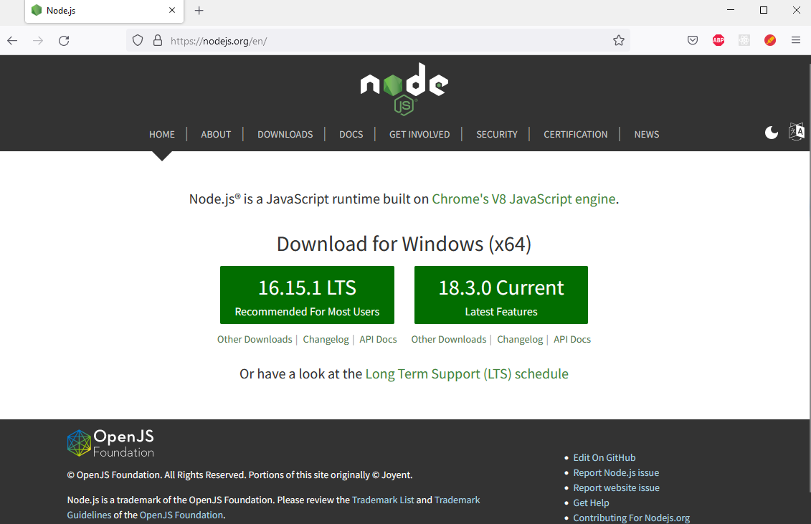
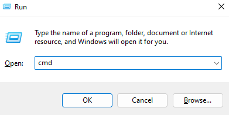
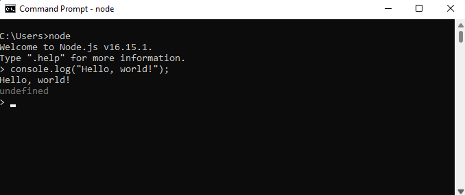
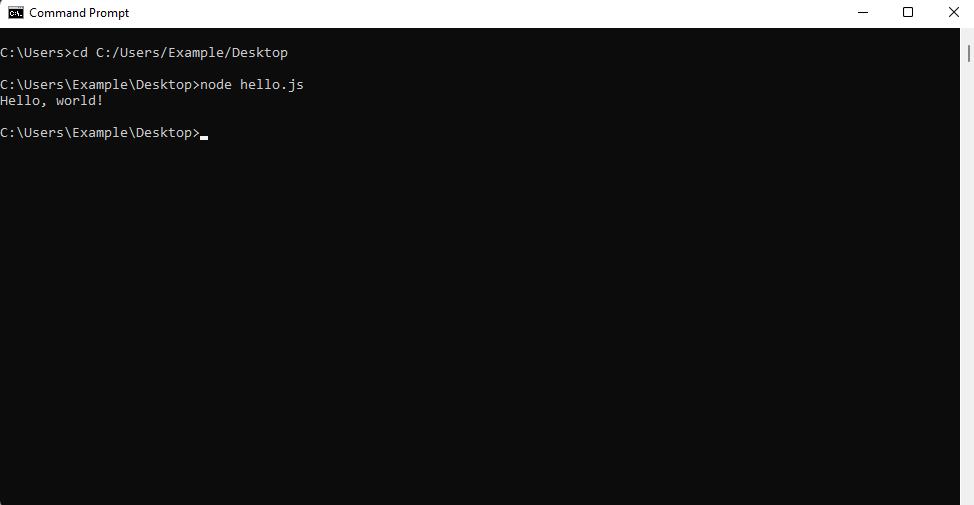

## Hello world

<div style="text-align: right"> <i> A journey of a thousand miles begins with a single "Hello, world!" program. <br> — Anchient Chinese proverb </i> </div>

### Runtime environments

Contrary to popular belief, code sadly doesn't run on magic or unicorn tears. Instead, it runs on something called a **runtime** (also referred to as *runtime environment*). Put simply, a runtime is a program capable of executing code written in some programming language. It *provides the environment in which programs can run*. In order to execute all the *awesome* JavaScript code we are about to write, we therefore need a runtime first.

There are two runtimes capable of executing JavaScript code which are relevant to this book - the browser and Node.js. Every runtime environment comes with a **console** which allows us to interact with and observe the output of JavaScript code.

In this section we will setup the browser and Node.js runtimes. Then we will print "Hello, world!" both to the browser console and to the Node.js console to test that our setup works as expected.

### The browser environment

Open a browser and open the console in your browser. If you are using *Firefox* the shortcut for opening the console is <kbd>Ctrl</kbd> + <kbd>Shift</kbd> + <kbd>K</kbd> on Windows or Linux and <kbd>Cmd</kbd> + <kbd>Shift</kbd> + <kbd>K</kbd> on a Mac. If you are using *Chrome* or *Microsoft Edge* the shortcut is <kbd>Ctrl</kbd> + <kbd>Shift</kbd> + <kbd>J</kbd> on Windows or Linux and <kbd>Cmd</kbd> + <kbd>Option</kbd> + <kbd>J</kbd> on a Mac.

> If you are using Internet Explorer, please navigate to `google.com` and search for "Firefox" to install a *real* browser. This line was originally intended to be a funny joke, but on June 15, 2022 Microsoft ended support for Internet Explorer, so it's not even a joke anymore. We recommend Firefox, but this is purely a personal preference. Chrome and Microsoft Edge are absolutely fine as well.

This is how the browser console will approximately look like on Firefox:


> Note that if you see a bunch of scary error or warning messages upon opening the console, *don't panic* (this is also good life advice in general). Most of these will probably come from various extensions you might have installed or the web page you are currently viewing. Simply delete the messages by clicking the icon in the top left of the console (trash can in firefox - might vary in different browsers), as we don't care about them.

The browser as well as the Node.js console have **REPL** (read-eval-print-loop) capabilities. This just means that you can type some code into the console directly and execute it. REPLs are very nice, because they allow you to quickly test what you just learned.

Let's print something using the `console.log` method. Type the following into the browser console:

```javascript
console.log("Hello, world!");
```

Now hit <kbd>Return</kbd> (you may also know this as <kbd>Enter</kbd> or simply <kbd>⏎</kbd>). You will see the output "Hello, world!" in the console:


> Ignore the "undefined" for now.

Hooray, we printed something to the browser console! This is the point at which you go tell everyone that you are now a *programmer*™.

### Executing JavaScript from an HTML file

Instead of executing JavaScript in the browser console directly, we can (and often will) execute it from an HTML file. HTML is short for *HyperText Markup Language* and is the standard markup language for documents that should be displayed in a browser. We will cover HTML in chapter 2 - for now we just want to get a quick glimpse at it.

Create a new HTML file. We will call it *hello.html*, however you can name it whatever you want. The filename should have an *html* extension though.

> If you are on a Windows machine, you probably cannot create a file with an `html` extension directly. In that case simply create an empty `txt` file and change the extension to `html`.

Open the HTML file in any text editor (we recommend you use [Visual Studio Code](https://code.visualstudio.com)) and add the following text to the file:

```html
<!DOCTYPE html>
<html>
<head></head>
<body>
  <script>
    console.log("Hello, world!");
  </script>
</body>
</html>
```

Don't forget to save the file!

> Note the semicolon after the console.log. It terminates the `console.log` statement. The semicolon is not technically required here. Indeed there are many JavaScript programmers who don't write semicolons. However to avoid a bunch of pitfalls we will use semicolons throughout this book and therefore we want you to get used to them as soon as possible.

Now open this file in your browser. If the `html` file extension is associated with your browser, you should be able to do so by simply double-clicking the file. If this is not the case, *right-click* the file. A menu containing the option "Open with" should pop up. Click on any browser name from the "Open with" submenu. This is how it would look like on Windows 11:


Alternatively just copy the path of the file and paste it into the address bar of your browser prefixed by `file:///`. For example if the file name is `C:/Users/Example/Desktop/hello.html`, you can open the file by typing `file:///C:/Users/Example/Desktop/hello.html` into the address bar and hitting <kbd>Return</kbd>:


> You can find out the path of a file by right-clicking the file and selecting *Properties*. The window that opens should show the file location.

After opening this file in your browser, open the console again. You should see "Hello, world!" printed there.

### Node.js

For a long time, programmers used JavaScript mostly inside the browser runtime environment. However in 2009 Node.js came along and changed that by allowing programmers to easily run JavaScript outside the browser.

Node.js will probably not be installed on your machine, so let's fix that. Grab Node.js from `https://nodejs.org`:



> Note that by the time you are reading this book the Node.js version you see on `https://nodejs.org` might be different.

You want to download the LTS (long term support) version. Click the big green button with the *LTS* version. This will download a Windows installer file. Execute the installer file just like you would execute any installer by double-clicking it. You will be presented with a bunch of options during the installation - just click "Next" everywhere and you will be fine.

Now we need to open a **command-line interface** (also called command line, command prompt or CLI) on our computer. A command line allows you to execute various tasks (called commands) on your computer.

On Windows, you can open the CLI by opening the "Run" window using <kbd>Win</kbd> + <kbd>R</kbd>, typing *cmd* and pressing the "Ok" button:



Alternatively you can type "cmd" into the search field. An app called "command prompt" should show up. Simply click the app and a CLI should open:


No matter how you do it, you should now stare at a *beautiful* command line. Take a second and *bask in it's glory* for a while.

After you're done basking, let's try and execute a command. For example we can use the `echo` command to output text. Try typing the following in your CLI:

```shell
echo "Hello, world!"
```

Now hit <kbd>Return</kbd> and you should see the following result:


Note that on a Mac you can open the command line by hitting <kbd>Cmd</kbd> + <kbd>Space</kbd> to open *search*, typing *terminal* and hitting <kbd>Return</kbd>.

> If you're on a Linux system you should *really* know how to open a command line.

Now that the command line is open, execute the `node` command to open a Node.js console. You can do so by typing `node` and hitting <kbd>Return</kbd>. You should see something like the following (again the Node.js version might be different):


Now let's again print "Hello, world!" using the `console.log` method. Type the following into the Node.js console and hit <kbd>Return</kbd>:

```javascript
console.log("Hello, world!");
```

You should see "Hello, world!" printed to the console:



### Executing a file

Before moving on, let's execute a JavaScript file containing some code. Create a file named `hello.js`. Open the file in any text editor (preferably Visual Studio Code) and add the following content to the file:

```javascript
console.log("Hello, world!");
```

> If you are on a Windows machine, you probably cannot create a file with a `js` extension directly. In that case simply create an empty `txt` file and change the extension to `js`.

Again open a command line and *change the current directory location to the directory containing the JavaScript file*. You can do so using the *cd* command. For example if `hello.js` is located at `C:/Users/Example/Desktop` you would execute the following:

```shell
cd C:/Users/Example/Desktop
```

> You can find out the directory containing the JavaScript file by right-clicking the file and selecting *Properties*. The resulting window should show the directory path.

Now execute the JavaScript file by running:

```shell
node hello.js
```

This should again print "Hello, world!":



Note that for the remainder of chapter 1 you should follow along using the Node.js console as we will be discussing the language itself. Nevertheless, as we begin writing the project in chapter 2, we will have to write JavaScript for the browser runtime environment on a regular basis.

### Statements and expressions

Before we dive into JavaScript, you should know what statements and expressions are.

A **statement** is a syntactic unit responsible for executing some action. A program is then essentially a sequence of statements which should be executed when running the program. For example `console.log('Hello, world!')` is a statement which executes the action of printing "Hello, world!" to the console.

An **expression** is a syntactic unit that may be evaluated to get its value. For example `2 + 2` would be an expression which would evaluate to `4`. Note that since any expression also executes some action, any expression is therefore a statement.

You could put it this way: Statements in general are executed to make something happen, while expressions in specific are evaluated to produce a value.

### Comments

Everything that is after a double slash on a line in JavaScript is a **comment**. Comments are ignored by the runtime and therefore have no effect for the execution of your program:

```javascript
// This is just a comment
// Comments have no effect
console.log('Hello, world!');
// Therefore this program is equivalent to the
// program from the previous chapter
```

We will heavily utilize comments throughout this book inside the code blocks to highlight important ideas.

> There is a lot of discussion on how much you should comment your programs. We will return to this when discussing functions. However one rule is that if your code is so terrible that it requires *extensive commentary* to explain its behavior or purpose, you should fix the code. Just like a work of art, your code stands on it's own merits. Imagine *commenting* a work of art (oh, wait)... However it is better to have terrible code and comments than have terrible code and no comments.

We will also adopt the convention that if a comment is next to a line with a `console.log` statement, that comment shows the output that would be logged to the console if the code was run. For example:

```javascript
console.log('Hello, world!'); // Hello, world!
```

This is the point where we tell you that while you are reading this book you should *absolutely follow along in some runtime* (probably Node.js, but a browser is fine too). This is *very important*. Go ahead and open a Node.js console *now*.

Come on, we'll wait...

...

...

...

*Finally*. Let's move on.

### Summary

You learned about JavaScript runtimes and the console. You also learned how to print "Hello, world!" to the console to check that your runtime works as expected.

### Further reading

There is no further reading for this section.
