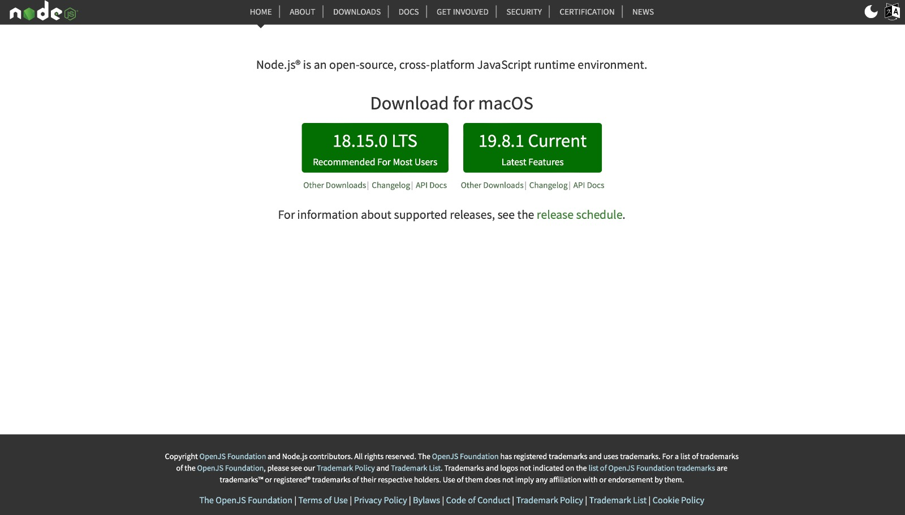
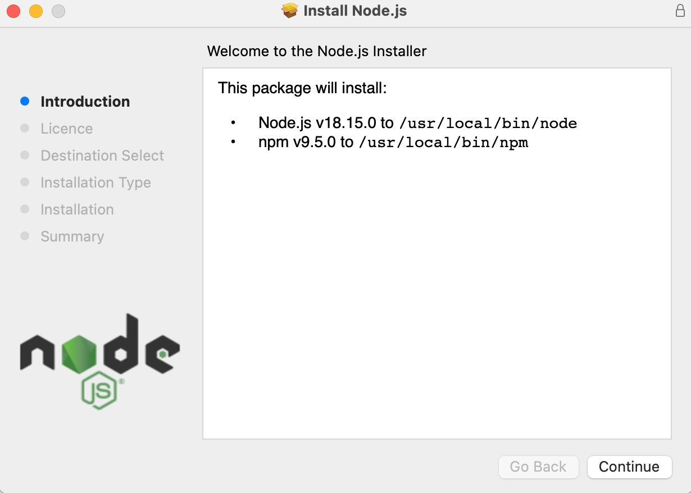

## Hello world

<div style="text-align: right"> <i> A journey of a thousand miles begins with a single "Hello, world!" program. <br> — Ancient Chinese proverb </i> </div>

### Runtime environments

Contrary to popular belief, code sadly doesn't run on magic or unicorn tears. Instead, it runs on something called a **runtime** (also referred to as _runtime environment_). Put simply, a runtime is a program capable of executing code written in some programming language. It _provides the environment in which programs can run_. In order to execute all the _awesome_ JavaScript code we are about to write, we therefore need a runtime first.

There are two runtimes capable of executing JavaScript code which are relevant to this book - the browser and Node.js. Every runtime environment comes with a **console** which allows us to interact with and observe the output of JavaScript code.

In this section we will setup the browser and Node.js runtimes. Then we will print "Hello, world!" both to the browser console and to the Node.js console to test that our setup works as expected.

### The browser environment

Open a browser and open the console in your browser. If you are using _Firefox_ the shortcut for opening the console is <kbd>Ctrl</kbd> + <kbd>Shift</kbd> + <kbd>K</kbd> on Windows or Linux and <kbd>Cmd</kbd> + <kbd>Shift</kbd> + <kbd>K</kbd> on a Mac. If you are using _Chrome_ or _Microsoft Edge_ the shortcut is <kbd>Ctrl</kbd> + <kbd>Shift</kbd> + <kbd>J</kbd> on Windows or Linux and <kbd>Cmd</kbd> + <kbd>Option</kbd> + <kbd>J</kbd> on a Mac.

> If you are using Internet Explorer, please navigate to `google.com` and search for "Firefox" to install a _real_ browser. Although this line was originally intended to be a humorous joke, on June 15, 2022, Microsoft [discontinued](https://learn.microsoft.com/en-us/lifecycle/products/internet-explorer-11) support for Internet Explorer, making it no longer a laughing matter. While we suggest Firefox, the choice of browser is purely a personal preference, as Chrome and Microsoft Edge are both excellent options.

This is how the browser console will approximately look like on Firefox:


> Note that if you see a bunch of scary errors or warning messages upon opening the console, _don't panic_ (this is also good life advice in general). Most of these likely originate from various extensions you might have installed or the web page you are currently viewing. You can simply ignore or delete these messages.

The browser as well as the Node.js console have **REPL** (read-eval-print-loop) capabilities. This just means that you can type some code into the console directly and execute it. REPLs are very nice, because they allow you to quickly test what you just learned.

Let's print something using the `console.log` method. Type the following into the browser console:

```javascript
console.log('Hello, world!');
```

Now hit <kbd>Return</kbd> (you may also know this as <kbd>Enter</kbd> or simply <kbd>⏎</kbd>). You will see the output `Hello, world!` in the console:


> Ignore the `undefined` for now.

Hooray, we printed something to the browser console! This is the point at which you go tell everyone that you are now a *programmer*™.

### Executing JavaScript from an HTML file

Instead of executing JavaScript in the browser console directly, we can (and often will) execute it from an HTML file. HTML is short for _HyperText Markup Language_ and is the standard markup language for documents that should be displayed in a browser. We will delve into HTML in Chapter 2, but for now, we just want to provide a very brief introduction to it.

Create a new HTML file. We will call it _hello.html_, though you can name it whatever you want. The filename should have an _html_ extension though.

> If you are on a Windows machine, you might be unable to create a file with an `html` extension directly. In that case simply create an empty `txt` file and change the extension to `html`.

Open the HTML file in any text editor (we recommend you use [Visual Studio Code](https://code.visualstudio.com)) and add the following text to the file:

```html
<!DOCTYPE html>
<html>
  <head></head>
  <body>
    <script>
      console.log('Hello, world!');
    </script>
  </body>
</html>
```

Don't forget to save the file!

> Note the semicolon after the `console.log` which terminates the `console.log` statement. The semicolon is not technically required here. Indeed there are many JavaScript programmers who don't use semicolons. However to avoid a bunch of pitfalls we will always use semicolons throughout this book and therefore we want you to get used to them as soon as possible.

Now open this file in your browser. If the `html` file extension is associated with your browser, you should be able to do so by simply double-clicking the file. If this is not the case, _right-click_ the file. A menu containing the option "Open with" should pop up. Click on any browser name from the "Open with" submenu. This is how it would look like on Windows 11:


Alternatively just copy the path of the file and paste it into the address bar of your browser prefixed by `file:///`. For example if the file name is `C:/Users/Example/Desktop/hello.html`, you can open the file by typing `file:///C:/Users/Example/Desktop/hello.html` into the address bar and hitting <kbd>Return</kbd>:


> You can find out the path of a file by right-clicking the file and selecting _Properties_. The window that opens should show the file location.

After opening this file in your browser, open the console again. You should see "Hello, world!" printed there.

### Node.js

For a long time, programmers used JavaScript mostly inside the browser runtime environment. However in 2009 Node.js came along and changed that by allowing programmers to easily run JavaScript outside the browser.

Node.js will probably not be installed on your machine, so we need to install it first.
Follow the installation instructions for your operating system (Windows and macOS).

#### Installing Node.js on Windows

Grab Node.js from https://nodejs.org:


> Note that by the time you are reading this book the Node.js version you see on `https://nodejs.org` might be different.

You want to download the LTS (long term support) version. Click the big green button with the _LTS_ version. This will download a Windows installer file. Execute the installer file just like you would execute any installer by double-clicking it. You will be presented with a bunch of options during the installation - just click "Next" everywhere and you will be fine.

Now we need to open a **command-line interface** (also called command line, command prompt or CLI) on our computer. A command line allows you to execute various tasks (called commands) on your computer.

On Windows, you can open the CLI by opening the "Run" window using <kbd>Win</kbd> + <kbd>R</kbd>, typing _cmd_ and pressing the "Ok" button:


Alternatively you can type "cmd" into the search field. An app called "command prompt" should show up. Simply click the app and a CLI should open:


#### Installing Node.js on macOS

Grab Node.js from https://nodejs.org:



> Note that by the time you are reading this book the Node.js version you see on https://nodejs.org might be different.

You want to download the LTS (long term support) version. Click the big green button with the _LTS_ version. This will download a pkg file. Execute the pkg file by double-clicking it. You will be presented with the following screen:



You will be presented with a bunch of options during the installation - just click "Continue" everywhere and you will be fine.

Now we need to open a **command-line interface** (also called command line, command prompt or CLI) on our computer. A command line allows you to execute various tasks (called commands) on your computer. On a Mac you can open the command line by hitting <kbd>Cmd</kbd> + <kbd>Space</kbd> to open _search_, typing _terminal_ and hitting <kbd>Return</kbd>.

### Working with the CLI

No matter which operating system you're on, you should now stare at a _beautiful_ command line.
Take a second and _bask in it's glory_ for a while.

After you're done basking, let's try and execute a command. For example we can use the `echo` command to output text. Try typing the following in your CLI:

```shell
echo "Hello, world!"
```

Now hit <kbd>Return</kbd> and you should see the following result:


> Note that while the images of the CLI have been taken on a Windows machine, the commands are the same on macOS.

Now that the command line is open, execute the `node` command to open a Node.js console. You can do so by typing `node` and hitting <kbd>Return</kbd>. You should see something like the following (again the Node.js version might be different):


Now let's again print "Hello, world!" using the `console.log` method. Type the following into the Node.js console and hit <kbd>Return</kbd>:

```javascript
console.log('Hello, world!');
```

You should see "Hello, world!" printed to the console:


### Executing a file

Before moving on, let's execute a JavaScript file containing some code. Create a file named `hello.js`. Open the file in any text editor (preferably Visual Studio Code) and add the following content to the file:

```javascript
console.log('Hello, world!');
```

> If you are on a Windows machine, you probably cannot create a file with a `js` extension directly. In that case simply create an empty `txt` file and change the extension to `js`.

Again open a command line and _change the current directory location to the directory containing the JavaScript file_. You can do so using the _cd_ command. For example if `hello.js` is located at `C:/Users/Example/Desktop` you would execute the following:

```shell
cd C:/Users/Example/Desktop
```

> You can find out the directory containing the JavaScript file by right-clicking the file and selecting _Properties_. The resulting window should show the directory path.

Now execute the JavaScript file by running:

```shell
node hello.js
```

This should again print "Hello, world!":


Note that for the remainder of chapter 1 you should follow along using the Node.js console as we will be discussing the language itself. Nevertheless, as we begin writing the project in chapter 2, we will have to write JavaScript for the browser runtime environment on a regular basis.

### Statements and expressions

Before we dive into JavaScript, you should know what statements and expressions are.

An **expression** is a "phrase" of JavaScript that may be evaluated to get its value.
For example `2 + 2` would be an expression which would evaluate to `4`.

A **statement** is a "sentence" of JavaScript responsible for executing some action.
For example `console.log('Hello, world!')` is a statement which executes the action of printing "Hello, world!" to the console.
Statements usually contain expressions which compute the values that are needed to correctly execute some action.

Finally, a **program** is a sequence of statements.
If we run the program, the sequence of statements is executed.
For example the `hello.js` program contains a single statement `console.log('Hello, world!')` which is executed when we run the program.

### Comments

In JavaScript, any text that appears after a double slash on a line is considered a **comment**.
Comments are disregarded by the runtime, so they have no impact on the execution of your program:

```javascript
// This is just a comment
// Comments have no effect
console.log('Hello, world!');
// Therefore this program is equivalent to the
// program from the previous section
```

We will heavily utilize comments throughout this book inside the code blocks to highlight important ideas.

> There is a lot of discussion on how much you should comment your programs. We will return to this when discussing functions. However one rule is that if your code is so terrible that it requires _extensive commentary_ to explain its behavior or purpose, you should fix the code. Just like a work of art, your code should stand on it's own merits. Imagine _commenting_ a work of art (oh, wait)... However it is better to have terrible code and comments than have terrible code and no comments.

We will also adopt the convention that if a comment is next to a line with a `console.log` statement, that comment shows the output that would be logged to the console if the code was run. For example:

```javascript
console.log('Hello, world!'); // Hello, world!
```

This is the point where we tell you that while you are reading this book you should _absolutely follow along in some runtime_ (probably Node.js, but a browser is fine too). This is _very important_. Go ahead and open a Node.js console _now_.

Come on, we'll wait...

...

...

...

_Finally_. Let's move on.

### Summary

You learned about JavaScript runtimes and the console. You also learned how to print "Hello, world!" to the console to check that your runtime works as expected.

### Further reading

There is no further reading for this section.
