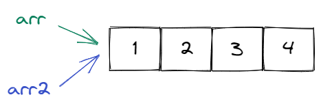
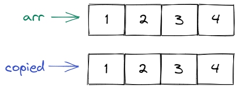

## Arrays and Objects

<div style="text-align: right"> <i> The object of the superior programmer is truthy. <br> — Confucius </i> </div>

### Arrays

Let's say you're writing a task application and you need to store a bunch of tasks.
You could declare a separate variable for every task like this:

```js
const task1 = 'First task';
const task2 = 'Second task';
const task3 = 'Third task';
```

However, this would quickly become very _tedious_.
Additionally, you probably want to be able to add or delete tasks in your application.
Adding and deleting variables will become even more _tedious_.
It would become almost as _tedious_ as repeating the word _tedious_ over and over.
Did we mention that this is really _tedious_?

As you can see, we need a way to store multiple values in a single variable.
We can do this with arrays.

A JavaScript **array** is an ordered collection of multiple values.
You can declare an array using an **array literal** (also called an _array initializer_ in this context):

```js
const tasks = ['First task', 'Second task', 'Third task'];
```

Note that an array is no longer a primitive type.
Instead, arrays have the type `object`:

```js
console.log(typeof tasks); // object
```

You can access individual elements of an array using the index notation.
This works by writing the name of the array, followed by the position of the element you want to retrieve inside square brackets `[]`.
Note that when we count the indices (positions), we start at `0`, _not_ at `1`:

```js
console.log(tasks[0]); // First task
console.log(tasks[1]); // Second task
```

If the array index is too big, trying to access the element at that index will return `undefined`:

```js
console.log(tasks[3]); // undefined
```

You can get the length of an array using `.length`:

```js
console.log(tasks.length); // 3
```

JavaScript has elegant syntax for working with arrays.
For example, if you want to assign variables based on values of an array, you would normally have to do something like this:

```js
const firstTask = tasks[0];
const secondTask = tasks[1];
const thirdTask = tasks[2];
```

This is (you guessed it) _tedious_.

Instead, you can use the **array destructuring assignment**:

```js
const [firstTask, secondTask, thirdTask] = tasks;
console.log(secondTask); // Second task
```

If you only care about some of the elements, you can use the **spread** (`...`) syntax:

```js
const [firstTask, ...otherTasks] = tasks;
```

Something that commonly trips up beginners is trying to _copy_ an array.
Let's say you have an array of numbers called `arr` and you want to create a copy called `arr2`.
You would probably try something like this:

```js
const arr = [1, 2, 3, 4];
const arr2 = arr;
```

This is _wrong_.
We can see that this is wrong if we try to change the first element of `arr` and then have a look at `arr[0]` and `arr2[0]`:

```js
arr[0] = 5;
console.log(arr[0]); // 5
console.log(arr2[0]); // 5
```

Uh-oh!
That's probably not what we want.
The reason for this behaviour is that `arr` and `arr2` both point to the same array.
Remember how we were careful to introduce a variable _as a storage location together with a symbolic name_?
Well, it turns out that _different symbolic names_ may refer to the _exact same storage location_.

You can visualize it like this:



Here we have a storage location containing the values `1`, `2`, `3` and `4` somewhere.
We also have two symbolic names `arr` and `arr2`.
While the symbolic names are different, they point to the same storage location.
Therefore, if we change the storage location, we will observe a change via _both_ symbolic names.

In order to actually copy the values, we can use the spread syntax again:

```js
const copied = [...arr];
```

Let's check that this is indeed an actual copy:

```js
arr[0] = 5;
console.log(arr[0]); // 5
console.log(copied[0]); // 1
```

This looks good.
Here is the mental picture you should have in your head for copying an array:



> If you only briefly skimmed the section on array destructuring and the spread syntax, go back again and read it carefully.
> These two concepts will come up _a lot_ in the following chapters (much more often than you think right now).

### Objects

Let's return to our imaginary (as of now) task application.
A task will probably be something more than just a string.
For example, it might contain an ID, a title and a description.
We could, again, try to store these values in separate constants:

```js
const taskId = 1;
const taskTitle = 'Read the Next.js book';
const taskDescription = 'Read and understand the Next.js book.';
```

As you can probably guess, this will quickly become _tedious_ (oh no, not this again).

**Objects** to the rescue!
These allow us to store name-value pairs inside a single variable.
Here is how we might create a `task` object that contains all the information we want to know about a task:

```js
const task = {
  id: 1,
  title: 'Read the Next.js book',
  description: 'Read and understand the Next.js book.',
};
```

Every such name-value pair is called a **property**.
We can access properties using the dot notation `.` or the square bracket notation `[]`.
For example, we can access the `title` property of the `task` object by writing `task.title` or `task['title']`.
Try it out:

```js
console.log(task.id); // 1
console.log(task.title); // Read the Next.js book
console.log(task.description); // Read and understand the Next.js book.
console.log(task['id']); // 1
console.log(task['title']); // Read the Next.js book
console.log(task['description']); // Read and understand the Next.js book.
```

> Note that we will practically always use the dot notation.

Remember how you accessed the length of an array using `arr.length`?
You can do that because every array has a property called `length` that indicates the length of that array.

Properties don't have to be primitive values.
They can also be other objects.

Generally speaking, you can arbitrarily nest objects and arrays.
For example, here is how you can nest an object inside an object:

```js
const user = {
  name: 'John Doe',
  task: {
    id: 1,
    title: 'Read the Next.js book',
    description: 'Read and understand the Next.js book.',
  },
};
```

You can access the `title` property of the `user.task` object like this:

```js
console.log(user.task.title); // Read the Next.js book
```

If you try to access a property that doesn't exist, the result will be `undefined`:

```js
console.log(task.date); // undefined
```

Sometimes you want to explicitly indicate that a property may be absent.
For example, a person may not have a task assigned to them.
You can write something like this:

```js
const person = {
  name: 'John Doe',
  task: undefined,
};
```

Instead of `undefined` you can also `null` which represents the absence of an object value.
Note that there is no separate `null` data type.
Instead, `null` is just a special object:

```js
console.log(typeof null); // object
```

Here is how you can use `null` to represent the absence of a property:

```js
const person = {
  name: 'John Doe',
  task: null,
};
```

Whether to use `undefined` or `null` in this situation is largely convention.
Throughout this book we will always use `undefined`.
Nevertheless, we want to emphasize that it's totally fine to use `null` instead of `undefined` in this situation.
Just pick a style and be consistent.

You can use the **destructuring assignment** when working with objects.
This is similar to arrays:

```js
const task = {
  id: 1,
  title: 'Read the Next.js book',
  description: 'Read and understand the Next.js book.',
};
const { id, title, description } = task;
```

And just as with arrays, you can use the spread syntax with objects:

```js
const taskWithAssignee = {
  assignee: 'John Doe',
  ...task,
};
console.log(taskWithAssignee);
```

This will output:

```
{
  assignee: 'John Doe',
  id: 1,
  title: 'Read the Next.js book',
  description: 'Read and understand the Next.js book.'
}
```

> Note that objects are more than just containers for values.
> We will return to this later.

### Using `const` with Arrays and Objects

There is often some confusion regarding the use of `const` with arrays and objects.

For example, it seems strange that you can change the elements of a `const` array:

```js
const arr = [1];
arr[0] = 2; // Totally valid
arr.push(3); // Totally valid
```

It seems equally strange that you can change the properties of a `const` object:

```js
const obj = { prop: 1 };
obj.prop = 2; // Totally valid
```

Such assignments are possible because `const` only applies to the constant itself, not to the contents of the constant.
This means that the only thing you _can't_ do is to change what the constant is pointing to altogether.

For instance, this is not possible:

```js
const arr = [1];
arr = [2, 3]; // Not valid
```

Similarly, this is also not possible:

```js
const obj = { prop: 1 };
obj = { prop: 2 }; // Not valid
```

This means that `const` is a pretty weak guarantee when working with arrays and objects.
After all, you often change elements of arrays and objects, but rarely change what the array and/or object is pointing to in its entirety.

Nevertheless, you should use `const` even when working with arrays and objects.
A weak guarantee is better than no guarantee at all.

### Classes

Instead of manually constructing objects, you can also use classes.

**Classes** are templates for creating objects.
For example, you could define a `Task` class that would serve as a template for creating task objects:

```js
class Task {
  constructor(id, title, description) {
    this.id = id;
    this.title = title;
    this.description = description;
  }
}
```

Note the presence of the special `constructor` method.
This method allows you to correctly initialize the object with some values.
Specifically, you can construct a task object from the `Task` class using the `new` operator:

```js
const task = new Task(1, 'Read the Next.js book', 'Read and understand the Next.js book.');
```

> If an object is constructed from a class `X`, we often say that the object is an `X` object.
> For example, the `task` variable is a `Task` object.

You can then access the instance properties as you normally would:

```js
console.log(task.id); // 1
console.log(task.title); // Read the Next.js book
console.log(task.description); // Read and understand the Next.js book.
```

Another important keyword for working with classes is the `this` keyword.
The `this` keyword allows you to point to the current instance of the class.
For example, we could write a method that gets a short description by combining the ID and title of a task like this:

```js
class Task {
  // constructor

  getShortDescription() {
    return `Task ${this.id} (${this.title})`;
  }
}
```

Let's now construct two tasks:

```js
const task1 = new Task(1, 'Read the Next.js book', 'Read and understand the Next.js book.');
const task2 = new Task(2, 'Write a task app', 'Write an awesome task app.');
```

We can now log the short description of the first task:

```js
console.log(task1.getShortDescription());
```

This will log:

```
Task 1 (Read the Next.js book)
```

Similarly, we can log the short description of the second task:

```js
console.log(task2.getShortDescription());
```

This will log:

```
Task 2 (Write a task app)
```

Why does this work?
Put differently, how does `getShortDescription` know whether it should refer to `task1` or `task2`?

The answer is the `this` keyword.
In the case of `task1.getShortDescription()`, `this` will refer to `task1` and so your code will access `task1.id` and `task1.title`.
However, in the case of `task2.getShortDescription()`, `this` will refer to `task2` and so your code will access `task2.id` and `task2.title`.
