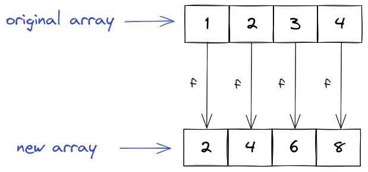

## Functional Thinking

<div style="text-align: right"> <i> Gold can't be pure, but functions can. <br> — Ancient Chinese proverb </i> </div>

### Pure Functions

A function is called **pure** if its outputs (the returned values) depend only on its inputs and if the function does not have any _side effects_ (i.e. it doesn't change program state and doesn't write anything to an external data source).

Here is an example of a pure function:

```js
const square = (x) => x * 2;
```

Indeed, the output of `square` depends only on its input and nothing else.
In addition, `square` doesn't produce any side effects.

Here is an example of a function that is _not_ pure:

```js
const x = 2;
const addImpure = (y) => x + y;
```

The output of this function doesn't depend just on its input variables, but also on a global variable `x`.

Here is another function that's not pure:

```js
const hello = () => console.log('Hello, world!');
```

The `hello` function has a side effect - it outputs something to the console.

Why do we care about all of this?
The fundamental reason is that _pure functions are very easy to reason about_.
There is practically no room for suprising behaviour.

Consider the above `square` function.
It takes an input and produces an output that is dependent _only on the input_.
It doesn't matter what the rest of the program is doing - the function will always produce identical outputs for identical inputs.

> If you are mathematically inclined, pure functions are basically regular mathematical functions.
> They take an input which is a member of some domain and produce an output which is a member of some codomain.
> For example the `square` function is simply the function f: A → B, f(x) = x² where A and B are certain sets of numbers.
> Note that A and B are emphatically _not_ equal to the set of real numbers since of course JavaScript cannot represent every possible real number (we already discussed this).

All of the above is not true for the `addImpure` function.
This function can produce _different_ outputs for identical inputs.
This makes it very hard to troubleshoot it in case of an error.
After all, you may not know what the (global) state of the program was when the error occured.

Closely related is another very nice property of pure functions - they are _easily testable_.
There is no need to fake global state as the function output depends only on the input.
Therefore all you need to do is to call the function, pass some input and check whether the output matches the expected output.

### Immutability

A variable is **immutable** if it is unchangeable.
Otherwise we call it **mutable**.
The more mutability we have inside our program the more can go wrong since it's hard to reason about (global) state.

This is where the alert reader might interject - after all, isn't the purpose of a program to do something?
And how can we achieve that if we don't change state?

A fundamental correction is in order here - the purpose of every program is not _to do something_, but to _manipulate data_.
You can of course manipulate data directly by mutating global state like in the following example:

```js
const task = {
  id: 1,
  title: 'Read the Next.js book',
  description: 'Read and understand the Next.js book.',
};
task.title = 'Next.js book';
```

This works for simple objects and changes.
But this will quickly become brittle with growing complexity.
_Reasoning about state and state changes is really hard._

Instead we can create copies of the objects which contain the changes we need:

```js
const newTask = {
  ...task,
  title: 'Next.js book',
};
```

Note that we didn't change the original object, but created a copy of the object with a different title.

Immutability and pure functions are closely linked.
The programs that are easiest to understand are the ones where immutable datastructures are passed through pure functions.

### Higher-order functions

We already know that JavaScript functions are just regular objects.
We even showed an example of how you can assign a function to a variable:

```js
const square = (num) => num * num;
```

This allows us do to interesting things.
Because functions are just objects we can _pass them to other functions_.

Consider an example function that repeats some action `n` times:

```js
function repeat(fun, n) {
  for (let i = 0; i < n; i++) {
    fun();
  }
}
```

We can use it like this:

```js
const hello = () => console.log('Hello, world!');
repeat(hello, 4);
```

Or even just:

```js
repeat(() => console.log('Hello, world!'), 4);
```

Both versions will output:

```
Hello, world!
Hello, world!
Hello, world!
Hello, world!
```

The important things about this is that the `repeat` function doesn't care what `fun` is.
Here `fun` could be a simple `console.log` or a function which produces a simulated universe.
All the `repeat` function does is to simply repeat `fun` the specified number of times.

Functions which take (or return) functions are called **higher-order functions**.

### The Trinity of `map`, `filter` and `reduce`

We now introduce the three most important higher-order functions - `map`, `filter` and `reduce`.
These functions allow you to perform an _incredibly_ rich set of operations on arrays.

> We want to use this blockquote to emphasize _how often_ you will be using `map`, `filter` and `reduce`.

We will use two running examples throughout the section - an array of `numbers` and an array of `tasks`:

```js
const numbers = [1, 2, 3, 4];
const tasks = [
  {
    id: 1,
    title: 'Read the Next.js book',
    description: 'Read and understand the Next.js book.',
    timeLogged: 60,
    status: 'In progress',
  },
  {
    id: 2,
    title: 'Write a task app',
    description: 'Write an awesome task app.',
    timeLogged: 0,
    status: 'Todo',
  },
  {
    id: 3,
    title: 'Think of a funny joke',
    description: 'Come up with a funny joke to lighten the mood.',
    timeLogged: 120,
    status: 'In progress',
  },
];
```

The `map` function takes one argument - a function `f` to apply to every element of the array.
It returns the array that results from applying `f` to every element of the original array.



Let's say we wanted to square all the elements of `numbers`.
We could write something like this:

```js
const result = [];
for (const number of numbers) {
  result.push(number ** 2);
}
```

This is ugly and (you guessed it) _tedious_.
Instead we can (and should) use the `map` function:

```js
const result = numbers.map((number) => number ** 2);
console.log(result); // [1, 4, 9, 16]
```

Consider another example.
Let's say we wanted to add a long description to all the `tasks` based on the title and the description.
We can use the `map` function again:

```js
const longTasks = tasks.map((task) => ({
  ...task,
  longDescription: `${task.title}: ${task.description}`,
}));
```

> You can see why the spread syntax is so handy.
> Thanks to this _incredible innovation_, you only need to explicitly specify the object parts where something interesting happens.

The `longTasks` array will look like this:

```js
[
  {
    id: 1,
    title: 'Read the Next.js book',
    description: 'Read and understand the Next.js book.',
    timeLogged: 60,
    status: 'In progress',
    longDescription: 'Read the Next.js book: Read and understand the Next.js book.',
  },
  {
    id: 2,
    title: 'Write a task app',
    description: 'Write an awesome task app.',
    timeLogged: 0,
    status: 'Todo',
    longDescription: 'Write a task app: Write an awesome task app.',
  },
  {
    id: 3,
    title: 'Think of a funny joke',
    description: 'Come up with a funny joke to lighten the mood.',
    timeLogged: 120,
    status: 'In progress',
    longDescription: 'Think of a funny joke: Come up with a funny joke to lighten the mood.',
  },
];
```

The `filter` function allows you to select elements from an array based on some condition.
It takes a function `f` which returns `true` or `false` for some input(s).
All elements for which `f` returns `true` are kept, all elements for which `f` returns `false` are thrown away.

> A function which returns `true` or `false` is commonly referred to as a _predicate_.

For example let's say we want to select all even elements from `numbers`.
Here is the non-functional way:

```js
const result = [];
for (const number in numbers) {
  if (number % 2 === 0) {
    result.push(number ** 2);
  }
}
```

Ugh!
For loops and if statements all over the place.
So _non-functional_.
Let's rest our eyes and consider the _functional_ approach:

```js
const result = numbers.filter((number) => number % 2 === 0);
```

The `filter` function also works in more complicated scenarios.
For example we might want to select all tasks from the `tasks` array which have the status `'Todo'`.

Think for a moment what the appropriate predicate would be.

That's right, it looks like this:

```js
const todoTasks = tasks.filter((task) => task.status === 'Todo');
```

Finally there is the `reduce` function which (you guessed it) _reduces_ an array to a single value.
The `reduce` function moves over an array from left to right and keeps track of a value (a so called _accumulator_).
At every element of the array it recomputes the accumulator based on a function `f` (this function `f` is the first argument of the `reduce` function).
The second argument of the reduce function is the initial value.

Here is how we might compute the sum of an array:

```js
const sum = numbers.reduce((acc, curr) => acc + curr, 0);
```

Basically this is what happens:

The `reduce` function looks at `acc` (which is the initial value, i.e. `0` at the beginning) and `curr` (which is `1`), produces `acc + curr`, and sets this as the new accumulator (i.e. the new accumulator is `1`).

Next the `reduce` function again looks at `acc` (which is now `1`) and `curr` (which is `2`), produces `acc + curr`, and sets this as the new accumulator (i.e. the new accumulator is `3`).

The next update results in the accumulator being `6` and the final update result in the accumulator being `10`.
Therefore `sum` will be `10`.

For another example, let's say we would like to compute the total logged time (i.e. the time logged for all the tasks combined).
This would look like this:

```js
const totalTime = tasks.reduce((curr, task) => task.timeLogged + curr, 0);
```

> We recommend that you try to reason through this `reduce` for a deeper understanding of this topic.

Note that unlike `map` and `filter`, you should use `reduce` sparingly as it's very easy to write _very convoluted_ code with `reduce`.
If you find yourself writing extremely complicated `reduce` expressions, you should consider using for loops and if statements instead.

### More Higher-Order Functions

While `map`, `filter` and `reduce` are the most known higher-order functions, JavaScript defines many more.
It is worthwhile to get to know them since they will make a lot of tasks easier.

The `find` method returns the first element in an array that satisfies some predicate:

```js
const numbers = [2, 8, 4, 12, 6, 10];
console.log(numbers.find((x) => x > 9)); // 12
```

The `findIndex` method is similar, except that it returns the _index_ of the first element in an array that satisfies some predicate:

```js
const numbers = [2, 8, 4, 12, 6, 10];
console.log(numbers.findIndex((x) => x > 9)); // 3
```

The `every` method checks whether all elements in an array satisfy a predicate:

```js
const numbers = [2, 8, 4, 12, 6, 10];
console.log(numbers.every((x) => x % 2 === 0)); // true
console.log(numbers.every((x) => x < 9)); // false
```

The `some` method checks whether there is at least one element in an array that satisfies a predicate:

```js
const numbers = [2, 8, 4, 12, 6, 10];
console.log(numbers.some((x) => x < 9)); // true
console.log(numbers.some((x) => x % 2 !== 0)); // false
```

The `forEach` method executes some function for every array element.
This is very similar to a for loop (hence the name):

```js
const numbers = [2, 8, 4, 12, 6, 10];
numbers.forEach((x) => console.log(x));
```

This will output:

```
2
8
4
12
6
10
```

### Sorting Arrays

The `sort` method can be used to sort the elements of an array:

```js
const tasks = ['Task 2', 'Task 1', 'Task 3'];
tasks.sort();
console.log(tasks); // [ 'Task 1', 'Task 2', 'Task 3' ]
```

The default sort order is ascending and elements are sorted by converting them to strings and then sorting the strings lexicographically.
However this may not be what you want, especially when you're trying to sort numbers:

```js
const numbers = [2, 8, 4, 12, 6, 10];
numbers.sort();
console.log(numbers); // [ 10, 12, 2, 4, 6, 8 ]
```

If you want to sort differently, you need to specify a **comparison function** `compareFn`.
This takes two arguments `a` and `b` and returns a number whose sign indicates the relative order of the elements in the sorted array.

If `compareFn(a, b)` is greater than `0` then `a` should be sorted after `b`.

If `compareFn(a, b)` is smaller than `0` then `a` should be sorted before `b`.

If `compareFn(a, b)` is equal than `0` then the original order of `a` and `b` should be kept.

For example, if you want to sort numbers in an ascending manner, you should specify the comparison function `(x, y) => x - y`.
After all, if `x - y` is greater than `0` then `y` will be sorted after `x` (which is exactly what you want).
Similarly, if `x - y` is smaller than `0` then `y` will be sorted before `x` (which is again what you want).

```js
const numbers = [2, 8, 4, 12, 6, 10];
numbers.sort((x, y) => x - y);
console.log(numbers); // [ 2, 4, 6, 8, 10, 12 ]
```

If you would want to sort numbers in a descending manner, you would need to change your comparison function to `(x, y) => y - x`:

```js
const numbers = [2, 8, 4, 12, 6, 10];
numbers.sort((x, y) => y - x);
console.log(numbers); // [ 12, 10, 8, 6, 4, 2 ]
```

You can use the comparison function to sort arbitrary objects as well.
For example, here is how you could sort the `tasks` array by the `timeLogged`:

```js
tasks.sort((task1, task2) => task1.timeLogged - task2.timeLogged);
```
