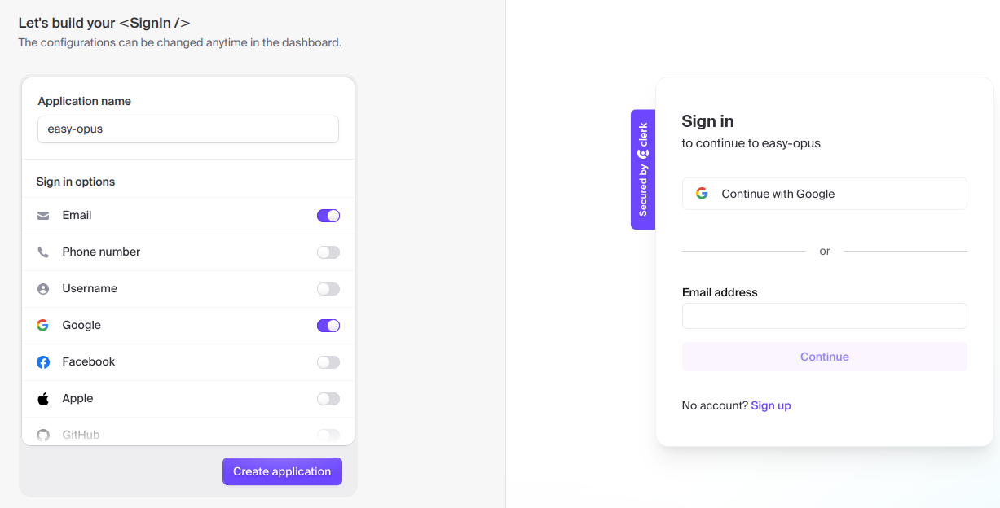

## Authentication

The tasks and projects should be "owned" by individual users of our application.

Of course, users should not be able to access or look at projects of other users.
This means that we need to implement authentication.

That used to be very hard - luckily, nowadays there are prebuilt libraries to help us out (at least for the common use cases).
We will use a library called Clerk.

Go to `dashboard.clerk.com` and create a new application.

Let's give the application the name `easy-opus`.
You will get a bunch of sign in options, we will select "Email" and "Google".
Click "Create application".



After you've created an application, you will be redirected to a page that shows the values of two API keys, namely `NEXT_PUBLIC_CLERK_PUBLISHABLE_KEY` and `CLERK_SECRET_KEY`.
You should copy these values to your `.env` file:

```
NEXT_PUBLIC_CLERK_PUBLISHABLE_KEY=$YOUR_NEXT_PUBLIC_CLERK_PUBLISHABLE_KEY
CLERK_SECRET_KEY=$YOUR_CLERK_SECRET_KEY
```

Next install `@clerk/nextjs`:

```sh
pnpm add @clerk/nextjs
```

Next we will need to add a `<ClerkProvider>` to our app in `layout.tsx`:

```jsx
import { ClerkProvider } from '@clerk/nextjs';

// ...

export default function RootLayout({ children }: { children: React.ReactNode }) {
  return (
    <ClerkProvider>
      <html lang="en">
        <body>{children}</body>
      </html>
    </ClerkProvider>
  );
}
```

Now we need to add a `middleware.ts` file that will specify what routes we want to protect:

```jsx
import { authMiddleware } from '@clerk/nextjs';

export default authMiddleware({
  publicRoutes: ['/'],
});

export const config = {
  matcher: [
    // Exclude files with a "." followed by an extension, which are typically static files.
    // Exclude files in the _next directory, which are Next.js internals.
    '/((?!.+\\.[\\w]+$|_next).*)',
    // Re-include any files in the api or trpc folders that might have an extension
    '/(api)(.*)',
  ],
};
```

> Note that `middleware.ts` should be directly in `src`, not in `src/app`.

Next, let's create the first version of the homepage `app/page.tsx`.

We will keep it simple for now.
If the user is not logged in, we will show the `SignIn` button.
Otherwise we will show a placeholder text:

```jsx
import { SignIn } from '@clerk/nextjs';
import { auth } from '@clerk/nextjs/server'
import * as React from 'react';

export default async function Home() {
  const { userId } = auth();

  if (userId === null) {
    return (
      <div className="flex justify-center items-center h-screen">
        <SignIn />
      </div>
    );
  }

  return <p>Projects will be here</p>;
}
```

Finally, let's add a navbar to every page that will show a `UserButton`.
Modify `app/layout.tsx`:

```jsx
import { ClerkProvider, UserButton } from '@clerk/nextjs';
import type { Metadata } from 'next';
import './globals.css';

export const metadata: Metadata = {
  title: 'Easy Opus',
  description: 'A simple task management application',
};

export default function RootLayout({ children }: { children: React.ReactNode }) {
  return (
    <ClerkProvider>
      <html lang="en">
        <body>
          <nav className="bg-blue-600 bg-opacity-70 text-white p-4 shadow-md flex items-center justify-between">
            <div className="flex justify-center w-full">
              <a href="/" className="text-lg font-bold">
                easy-opus
              </a>
            </div>
            <div className="absolute right-4">
              <UserButton />
            </div>
          </nav>
          <>{children}</>
        </body>
      </html>
    </ClerkProvider>
  );
}
```

If you try accessing `localhost:3000` now you will see a sign-in form provided by Clerk.js.
You can use this to sign in with your Google account or create a new account with an email and password and sign in using that.

Once you are signed in, you will see a page with a navbar, a user button in the top right corner and the placeholder text `Projects will be here`.
