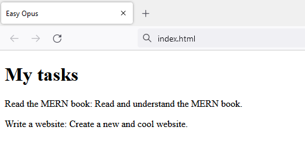

## HTML and the DOM

<div style="text-align: right"> Hey guys, how do I parse HTML with a regular expression? <br> <i> - Famous last words </i> </div>

### A minimal HTML file

Inside your project directory (*easy-opus* in our case) create a directory which will contain the (website) client. Give the directory a descriptive name (for example *client*). If you followed our naming scheme, your directory structure should now look as follows:

```
easy-opus/
└─── client/
```

Let's write our first webpage. We do so using **HTML** which is a *markup language* for defining for documents that should be displayed in a browser.

> A markup language specifies rules which define what kind of information can be included in a document. Note that markup languages and programming languages are different things. A markup language essentially allows you to create documents to be displayed, while programming languages are much more powerful than that.

Navigate to the client directory and create a file named `index.html` in there. Now write some minimal useful HTML to display a bunch of tasks:

```html
<!DOCTYPE html>
<html lang="en">
  <head>
    <meta charset="UTF-8" />
    <title>Easy Opus</title>
  </head>
  <body>
    <div id="root">
      <div>
        <h1>My tasks</h1>
        <div>
          <p>
            Read the MERN book: Read and understand the MERN book.
          </p>
          <p>
            Write a website: Create a new and cool website.
          </p>
        </div>
      </div>
    </div>
  </body>
</html>
```

If you open the HTML file in your browser you should see something like this:



Hooray, you've created a simple HTML document! Now you can close this book and go procrastinate. No? Hm, that's weird. Oh, your boss forced you to read this book (*blink once* if you need help)? Well in that case, we continue by trying to figure out what we just wrote.

### HTML elements

HTML essentially consists of elements which you can use to declare what *kind* of content you would like to render. For example the `p` element is a paragraph:

```html
<p> Read the MERN book: Read and understand the MERN book. </p>
```

An HTML element usually has some *content* inside an *opening tag* and a *closing tag*. The opening tag is the name of the element wrapped in angle brackets (`<p>` in the above example). The closing tag is the name of the element wrapped in angle brackets with a *forward slash before the name* (`</p>` in the above example).

There are many different HTML elements. We already learned that `p` is a paragraph and `div` is a generic container. We will talk about other elements later on.

What makes HTML so powerful is the fact that *most* elements can be *nested*. For example here is how you can nest a paragraph inside a generic container:

```html
<div>
  <p> Read the MERN book: Read and understand the MERN book. </p>
</div>
```

Elements can also have *attributes*. Two of the most important attributes are `id` and `class`. The `id` attribute is used to specify a *unique identity* for an HTML element. You can use that attribute to uniquely identify the element. The `class` attribute is used to specify a *class* for an HTML element. Unlike unique identifiers, multiple HTML elements can have the same class. This is extremely useful for example if you want to *style* multiple HTML elements in the same way. For example you could color all HTML elements of class `blue-text` blue. There are many more attributes and different HTML elements often have different attributes - we will discuss this in a second.

If you look at `index.html` you will see the structure of an HTML document. An HTML document begins with `<!DOCTYPE html>` which is a *document type declaration*. This is followed by an `html` element which contains all the content of the document. The `head` element contains everything that is not directly related to the content that will be displayed on the page. In the above example we declared the title of the page (which will become the name of the tab once the page is opened) and what kind of character encoding we use. Finally the `body` element contains all the content that will actually be rendered on the page. In our example the task list we want to render is inside the `body` element.

> We will later talk about character encodings in great detail.

### The Document Object Model

Once you open an HTML document in a browser, it is represented by the **Document Object Model** (DOM for short). Basically DOM is a model for documents which represent *editable logical trees*. This sounds *way* scarier than it really is. Let's explain this using an example. Looking at our HTML file, we have some HTML that looks like this:

```html
<div>
  <p>
    Read the MERN book: Read and understand the MERN book.
  </p>
  <p>
    Write a website: Create a new and cool website.
  </p>
</div>
```

Here we have a `<div>` element (which is a generic container) and two `<p>` (paragraph) elements inside that div element. The `<div>` element is the *parent* of the `<p>` elements and the `<p>` elements are the *children* of the `<div>` element. The elements form a *tree*.

Consider this HTML:

```html
<div id="root">
  <h1>My tasks</h1>
  <div>
    <p>
      Read the MERN book: Read and understand the MERN book.
    </p>
    <p>
      Write a website: Create a new and cool website.
    </p>
  </div>
</div>
```

You can visualize it like this:


> As a side note, HTML elements do not need to have an ID.

## Manipulating the DOM using JavaScript

Whenever you write applications which have a lot of logic in the client, you will need to manipulate the DOM (i.e. add or remove items). For example, if we add a task, we might need to add some elements to the current tree representing the task. This is how the corresponding JavaScript™ code would look like:

```javascript
const taskText = 'Do something else: Just do something already.'
const element = document.createElement('p');
element.innerHTML = taskText;
const todoList = document.getElementById('todoList');
todoList.append(element);
```

This JavaScript™® code already looks cumbersome and annoying. It will only get more annoying once the logic becomes more complex. Manually manipulating the DOM in JavaScript™®℠ is generally a bad idea as it leads to unreadable and unmaintainable code. And unreadable code is almost as bad as inserting unnecessary trademark symbols into a text just for the heck of it. Your fellow developers will *really* hate you if you do that.

To make our lives simpler, we will use a UI library called **React**. The idea behind React is to create declarative UIs with nicely separated components. Basically we only define how the application should look like (hence the *declarative*) and React will figure out the rest (like which DOM manipulations are needed). This is pretty neat, as you will soon see for yourself.

### Summary

You know what HTML is and how HTML elements look like. You also know about the DOM and why you wouldn't want to manipulate it using JavaScript manually.

### Further reading

* [Introduction to HTML - Getting started with HTML](https://developer.mozilla.org/en-US/docs/Learn/HTML/Introduction_to_HTML/Getting_started)

