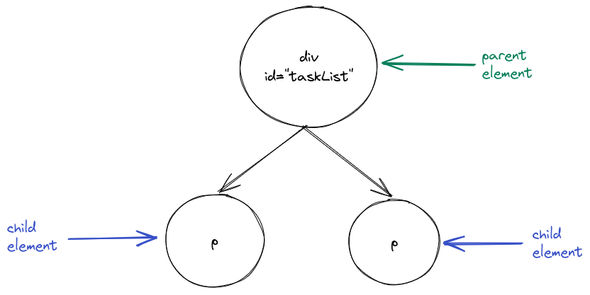
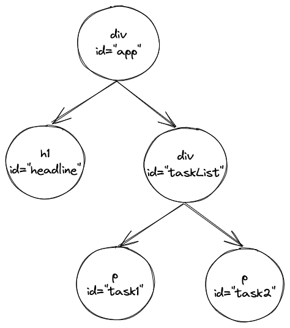

## The Document Object Model

<div style="text-align: right"> <i> Well, DOM and HTML are baaaasically the same thing. <br> - Famous last words </i> </div>

### The Document Object Model

When you open an HTML document in a browser, it is represented by the **Document Object Model** (DOM for short).
Essentially, the DOM is a model for documents which represent _editable logical trees_.
This sounds _way_ scarier than it really is, so let's consider an example from our HTML file:

```html
<div id="taskList">
  <p> Read the MERN book: Read and understand the MERN book. </p>
  <p> Write a website: Create a new and cool website. </p>
</div>
```

Here we have a `<div>` element (which is a generic container) and two `<p>` (paragraph) elements inside it.
The `<div>` element is the _parent_ of the `<p>` elements and the `<p>` elements are the _children_ of the `<div>` element.
The elements form a (very small) _tree_:



Let's take the original body HTML:

```html
<div id="app">
  <h1>My tasks</h1>
  <div id="taskList">
    <p> Read the MERN book: Read and understand the MERN book. </p>
    <p> Write a website: Create a new and cool website. </p>
  </div>
</div>
```

You can visualize it like this:



It's crucial to distinguish between HTML and the DOM, as they are _absolutely_ not the same thing.
The DOM is a _language-agnostic model_ that represents the structure of a document.
On the other hand, HTML is a _specific language_ that encodes a particular kind of DOM into text usable by web browsers.

## Manipulating the DOM using JavaScript

Whenever you write applications which have a lot of logic in the client, you will need to manipulate the DOM (i.e. add, remove or change items).
For example, if we add a task, we might need to add some elements to the current tree representing the task.
This is how the corresponding JavaScript™ code would look like:

```javascript
const paragraph = document.createElement('p');
paragraph.innerHTML = 'New task';
const taskList = document.querySelector('#taskList');
taskList.appendChild(paragraph);
```

We could now add a button and execute this code whenever the button is clicked by registering a `click` event listener on the button:

```html
<!DOCTYPE html>
<html lang="en">
  <head>
    <meta charset="utf-8" />
    <title>Easy Opus</title>
    <script>
      function addTask() {
        const paragraph = document.createElement('p');
        paragraph.innerHTML = 'New task';
        const taskList = document.querySelector('#taskList');
        taskList.appendChild(paragraph);
      }
      function setup() {
        const button = document.querySelector('#addTask');
        button.addEventListener('click', addTask);
      }
    </script>
  </head>
  <body onload="setup()">
    <div id="taskList">
      <button id="addTask">Add a task</button>
    </div>
  </body>
</html>
```

This JavaScript™® code already looks cumbersome and annoying.
It will only get more annoying once the logic becomes more complex.
Manually manipulating the DOM in JavaScript™®℠ is generally a bad idea as it leads to unreadable and unmaintainable code.
And unreadable code is almost as bad as inserting unnecessary trademark symbols into a text just for the heck of it.
Your fellow developers will _really_ hate you if you do that.

To simplify our lives, we will use a UI library called **React**.
The idea behind React is to create declarative UIs with nicely separated components.
Basically we only define how the application should look like (hence the _declarative_ aspect) and React takes care of the rest, such as determining the necessary DOM manipulations.
As you will soon see, this is an incredibly useful feature.

### Summary

You know what HTML is and how HTML elements look like. You also know about the DOM and why you wouldn't want to manipulate it using JavaScript manually.

### Further reading

- [Introduction to the DOM](https://developer.mozilla.org/en-US/docs/Web/API/Document_Object_Model/Introduction)
