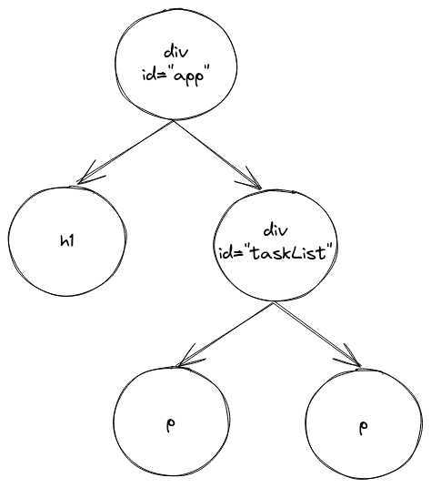

## The Document Object Model

<div style="text-align: right"> <i> Well, DOM and HTML are baaaasically the same thing. <br> — Seconds before disaster </i> </div>

### HTML and DOM

When you open an HTML document in a browser, it's represented by the **Document Object Model** (DOM for short).
Essentially, the DOM is a model for documents which represent _editable logical trees_.

This sounds _way_ scarier than it really is, so let's consider an example:

```html
<div id="task-list">
  <p> Read the Next.js book </p>
  <p> Write a website </p>
</div>
```

Here, we have a `<div>` element (the generic container) and two `<p>` (paragraph) elements inside it.
The `<div>` element is the _parent_ of the `<p>` elements and the `<p>` elements are the _children_ of the `<div>` element.
The elements form a (very small) _tree_:


Let's take a look at a bigger document:

```html
<div id="app">
  <h1>My tasks</h1>
  <div id="task-list">
    <p> Read the Next.js book </p>
    <p> Write a website </p>
  </div>
</div>
```

You can visualize this document in the following way:



It's crucial to distinguish between HTML and the DOM, as they are _absolutely_ not the same thing.
The DOM is a _language-agnostic model_ that represents the structure of a document.
On the other hand, HTML is a _specific language_ that encodes a particular kind of DOM into text usable by web browsers.

To simplify, _you_ write an HTML document, the browser parses that document into a DOM tree and then _the browser_ displays a DOM tree.

### Manipulating the DOM using JavaScript

Whenever you write applications which have a lot of logic in the client, you will need to manipulate the DOM (i.e. add, remove, change or retrieve elements).
This can be done by using JavaScript functions that exist on the `document` object, which is a global variable that refers to the currently rendered DOM tree.

For the rest of this section, we will consider the following document:

```html
<!DOCTYPE html>
<html lang="en">
  <head>
    <meta charset="utf-8" />
    <title>Easy Opus</title>
  </head>
  <body>
    <div id="app">
      <h1>My tasks</h1>
      <div id="task-list">
        <p id="first-paragraph" class="task"> Read the Next.js book </p>
        <p id="second-paragraph" class="task"> Write a website </p>
      </div>
    </div>
  </body>
</html>
```

> If you want to follow along, you can open this document in a browser, open the JavaScript console and then write the code in the console.

First, let's talk about how to _retrieve_ elements.

The `document.getElementById(id)` function allows you to select an element by its unique ID:

```js
const paragraph = document.getElementById('first-paragraph');
console.log(paragraph); // <p id="first-paragraph" class="task">
```

Note that `paragraph` is just a regular JavaScript object.

For example, you could access various properties like the element ID and class or the HTML markup contained within the element:

```js
console.log(paragraph.id); // first-paragraph
console.log(paragraph.className); // task
console.log(paragraph.innerHTML); // Read the Next.js book
```

We can also get all the elements that have a certain class using `document.getElementsByClassName(className)`:

```js
const tasks = document.getElementsByClassName('task');
console.log(tasks); // HTMLCollection { 0: p#first-paragraph.task, 1: p#second-paragraph.task, length: 2, … }
```

Note that `tasks` is an `HTMLCollection` which is an array-like object.
This means that it behaves similar to an array (for example you can index it), but doesn't have most of the array methods we learned in the first chapter:

```js
console.log(tasks.length); // 2
console.log(tasks[0]); // <p id="first-paragraph" class="task">

// This will throw a TypeError: tasks.map is not a function
const ids = tasks.map((task) => task.id);
```

You can also retrieve all elements with a certain tag by using `document.getElementsByTagName(tagName)`.
Consider this example:

```js
const paragraphs = document.getElementsByTagName('p');
console.log(paragraphs); // HTMLCollection { 0: p#first-paragraph.task, 1: p#second-paragraph.task, length: 2, … }
```

Note how this is again an `HTMLCollection`.

The two most important and modern JavaScript methods for element retrieval are `document.querySelector(selector)` and `document.querySelectorAll(selector)` which return the first and all elements that match a certain CSS selector respectively.

Here is how we could use these methods to accomplish our tasks from before:

```js
// The hash (#) indicates an ID selector
const paragraph = document.querySelector('#first-paragraph');
// The period (.) indicates a class selector
const tasks = document.querySelectorAll('.task');
const paragraphs = document.querySelectorAll('p');
```

Note that this time `tasks` will be a `NodeList` (instead of an `HTMLCollection`).
However, a `NodeList` is still an array-like object that you can index with `[]`.

JavaScript also allows us to create elements and append them to other elements.
You can create elements using `document.createElement(tagName)`.

This is how you could create a paragraph with an ID, a class and some text:

```js
const element = document.createElement('p');
element.id = 'thirdParagraph';
element.classList.add('task');
element.innerHTML = 'New task';
```

You can append an element as a last child of a parent element using `parentElement.appendChild(childElement)`.
For example, to append the newly created `element` to another element `taskList` you would write this:

```js
// Retrieve the taskList element
const taskList = document.querySelector('#task-list');

// Append element to taskList
taskList.appendChild(element);
```

Let's put all of this together and add a new task using these methods:

```js
const paragraph = document.createElement('p');
paragraph.id = 'third-paragraph';
paragraph.classList.add('task');
paragraph.innerHTML = 'New task';
const taskList = document.querySelector('#task-list');
taskList.appendChild(paragraph);
```
