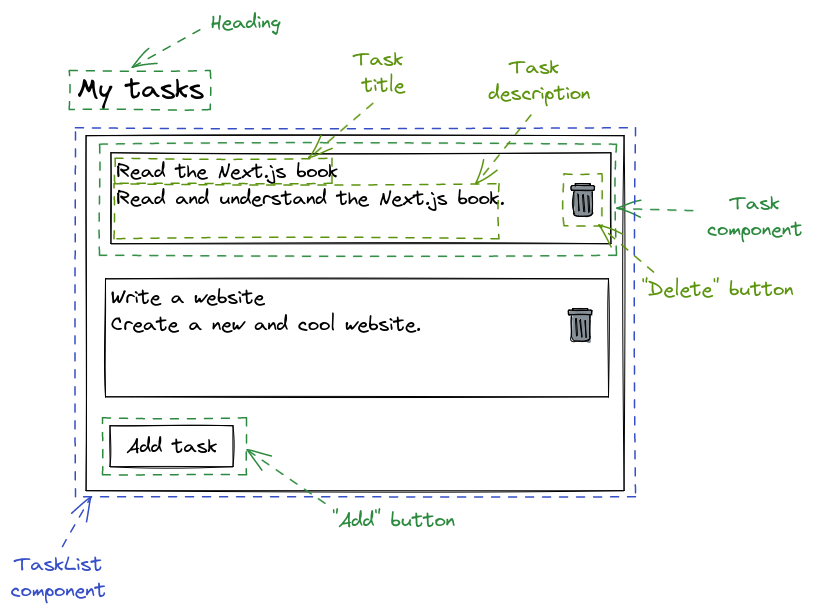

## React Components

<div style="text-align: right"> <i> Why do React components have great self-esteem? <br> Because they keep getting props. <br> — From "1000 programming dad-jokes" </i> </div>

### Why React Components?

The idea behind React is that you can think about a web page in terms of isolated **components**, where every component is an _independent and reusable piece of the UI_.

Consider a potential first version of our _easy-opus_ app, which would need to display a bunch of tasks.

Every task could be its own component containing the task title, description and a button to delete the task.
The title, description and the button could in turn be components themselves.

The tasks might then be grouped in a task list component, which in addition to the tasks, should have a button to add a new task.

Here is a simple mockup of the structure of our new web page:



Now comes the interesting part about React.
In terms of implementation, a component is just a _regular JavaScript function_ that takes the _data it should render as input_ and returns the _UI representation of the data as output_.

Here is an example of how the `Task` component could look like:

```jsx
function Task({ title, description }: { title: string, description: string }) {
  return (
    <div>
      <p>{title}</p>
      <p>{description}</p>
      <button>Delete</button>
    </div>
  );
}
```

> Currently, our components have no styling.
> We'll fix this in another chapter, for now we just focus on the logic.

Let's have a look at this function.

Looking at its inputs, we see that it takes an object containing the data it should render.
Here the data to be rendered are the `title` and the `description`.

Looking at its outputs, we see that it returns the UI representation of the data.
Here the UI representation is a `div` containing the `title`, `description` and a button.

> Note that the button currently doesn't do much.
> We will change this later.

To see components in action, let's actually create a simple React project.

### Create a React Project

To create a React project, we will use a tool called Vite, which provides various frontend tooling (including a development server and optimized builds).

First, let's create a new `vite` project:

```sh
pnpm create vite
```

You will be asked to select various options.
Select `React` for the framework and `TypeScript + SWC` for the variant.

After you've created the new project, the tool will even output the commands you should execute afterwards (which is quite helpful).

Now navigate to the newly created directory, where your project resides:

```sh
cd example
```

You will see a couple of familiar files, including a `package.json` which—among other things—includes the dependencies of the project.
Let's install those dependencies:

```sh
pnpm install
```

Finally, you can run a development server:

```sh
pnpm dev
```

If you go to `http://localhost:5173` and look at the result, you will see a web page with some demo content.
Let's replace this demo content with our own components!

First, you can remove `App.tsx`, `App.css`, `index.css` and the `assets/` folder.
We will not need these right now.

Replace the code in `main.tsx` with the following very simple task list:

```jsx
import ReactDOM from 'react-dom/client';

function App() {
  return (
    <div>
      <h1>Tasks</h1>
      <ul>
        <li>Read the Next.js book</li>
        <li>Write a website</li>
      </ul>
    </div>
  );
}

ReactDOM.createRoot(document.getElementById('root')!).render(<App />);
```

Save the file and navigate to `http://localhost:5173` once more.
You will now see our component.

> This is one of the greatest features of the development server—it will automatically recreate the page when you edit your code.

If you've paid attention so far, there should be a giant question mark in your head now: Why are we allowed to write HTML in our JavaScript?

The answer is simple: The syntax is not actually HTML (cue ominous music here).

### Introducing JSX

Consider our `App` function:

```jsx
function App() {
  return (
    <div>
      <h1>Tasks</h1>
      <ul>
        <li>Read the Next.js book</li>
        <li>Write a website</li>
      </ul>
    </div>
  );
}
```

While this might look like HTML, it is important to emphasize that this is _absolutely not_ HTML.
Instead this syntax is something called **JSX**, which is a _syntax extension_ to _JavaScript_ that can be transpiled to _normal_ JavaScript.

To be precise, the JSX will be transpiled to calls to the `React.createElement` function which will return regular JavaScript objects.
The root object will be dynamically added to the DOM using this line of code:

```jsx
ReactDOM.createRoot(document.getElementById('root')!).render(<App />);
```

The difference between JSX and HTML is not just a nitpick.
For example, in JSX we can (and will) use and nest our own components exactly like we would use and nest HTML elements.

Here is an example of a `TaskList` component rendered inside the `App` component:

```jsx
import ReactDOM from 'react-dom/client';

function App() {
  return <TaskList />;
}

function TaskList() {
  return (
    <div>
      <h1>Tasks</h1>
      <ul>
        <li>Read the Next.js book</li>
        <li>Write a website</li>
      </ul>
    </div>
  );
}

ReactDOM.createRoot(document.getElementById('root')!).render(<App />);
```

> While possible, it's much more complicated (and relatively rare) to add your own custom tags in HTML.

Additionally, you can include JavaScript expressions in JSX by wrapping them in curly braces `{}`.
For example, this is a totally valid React component:

```jsx
function Example() {
  const x = 2;
  const y = 2;
  return <p>{x + y}</p>;
}
```

You can't do this in regular HTML.

### Add Props to a React Component

JSX is great, but our current `TaskList` component is not.
The main problem is that the data it represents is hardcoded into the component.

We fix that by passing properties (`props`) to the component.
This is simply a JavaScript object containing the data the component should render.

In the case of the `TaskList` we simply want to pass an array of strings named `tasks` containing our—well—tasks.
We can then use the `map` function to create a list item `li` for each element of that array:

```jsx
type TaskListProps = {
  tasks: string[],
};

function TaskList(props: TaskListProps) {
  return (
    <ul>
      {props.tasks.map((task) => (
        <li>{task}</li>
      ))}
    </ul>
  );
}
```

This is already not too bad, but of course we want to take advantage of the latest and greatest JavaScript syntax there is.
Writing `props.tasks` is annoying and will become even more annoying when we have a lot of props.

We can use object destructuring to alleviate this:

```jsx
function TaskList({ tasks }: TaskListProps) {
  return (
    <ul>
      {tasks.map((item) => (
        <li>{item}</li>
      ))}
    </ul>
  );
}
```

> You can see how all the concepts from the JavaScript and TypeScript chapters are coming together quite nicely.

Excellent!
We can use the new component like this:

```jsx
function App() {
  return (
    <div>
      <h1>Tasks</h1>
      <TaskList tasks={['Read the Next.js book', 'Write a website']} />
    </div>
  );
}
```

Note that there is a problem with the current implementation of our component.
If you open your browser console, you will see an error:

```
Warning: Each child in a list should have a unique 'key' prop.
```

The reason for that is that React needs a way to identify which items in a list have changed or have been added or removed.
It does that by looking at the keys of the items.
These basically give the elements a stable identity.

Let's add IDs to the tasks and use the task IDs as keys for the component:

```jsx
function App() {
  const tasks = [
    {
      id: 'TSK-1',
      title: 'Read the Next.js book',
    },
    {
      id: 'TSK-2',
      title: 'Write a website',
    },
  ];

  return (
    <div>
      <h1>Tasks</h1>
      <TaskList tasks={tasks} />
    </div>
  );
}

function TaskList({ tasks }: TaskListProps) {
  return (
    <ul>
      {tasks.map((item) => (
        <li key={item.id}>{item.title}</li>
      ))}
    </ul>
  );
}
```

There is one final improvement we can make:
The `div` element in `App` is pretty useless, since it only serves the purpose of wrapping the `h1` and `TaskList` (since a component can only return a single JSX element).
Luckily, there is a special component called a React **fragment** which allows us to wrap multiple JSX elements without showing up in the DOM later.

You can create a fragment using the `<></>` syntax:

```jsx
function App() {
  const tasks = [
    {
      id: 'TSK-1',
      title: 'Read the Next.js book',
    },
    {
      id: 'TSK-2',
      title: 'Write a website',
    },
  ];

  return (
    <>
      <h1>Tasks</h1>
      <TaskList tasks={tasks} />
    </>
  );
}
```

### Improving our Project Structure

We should note that it's common practice to put components into separate files (unless two components are heavily related to each other).

In this example, we might put the `TaskList` component into a file `task-list.tsx`:

```jsx
type Task = {
  id: string,
  title: string,
};

type TaskListProps = {
  tasks: Task[],
};

export function TaskList({ tasks }: TaskListProps) {
  return (
    <ul>
      {tasks.map((item) => (
        <li key={item.id}>{item.title}</li>
      ))}
    </ul>
  );
}
```

Note that we have to `export` the `TaskList` component so that we can `import` it in our `index.tsx` file:

```jsx
import { TaskList } from 'task-list';

function App() {
  const tasks = [
    {
      id: 'TSK-1',
      title: 'Read the Next.js book',
    },
    {
      id: 'TSK-2',
      title: 'Write a website',
    },
  ];

  return (
    <div>
      <h1>Tasks</h1>
      <TaskList tasks={tasks} />
    </div>
  );
}

ReactDOM.createRoot(document.getElementById('root')!).render(<App />);
```

Now, we have two separate files.
The `index.tsx` file contains our main `App` component and the `task-list.tsx` file contains our `TaskList` component.
Additional components will go into additional files, allowing us to keep our codebase well structured and maintainable.
